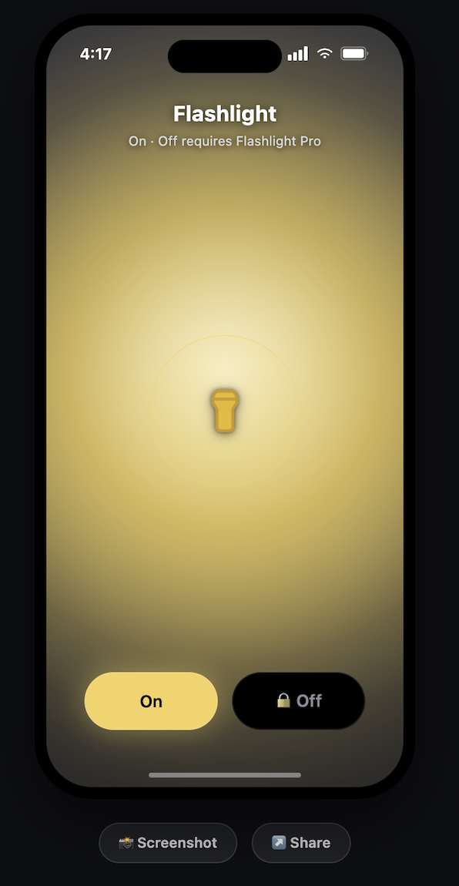
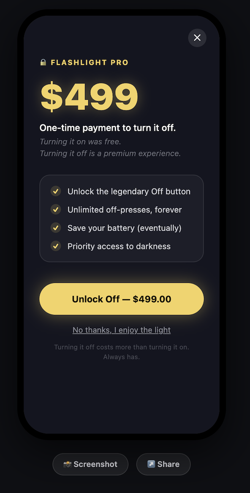
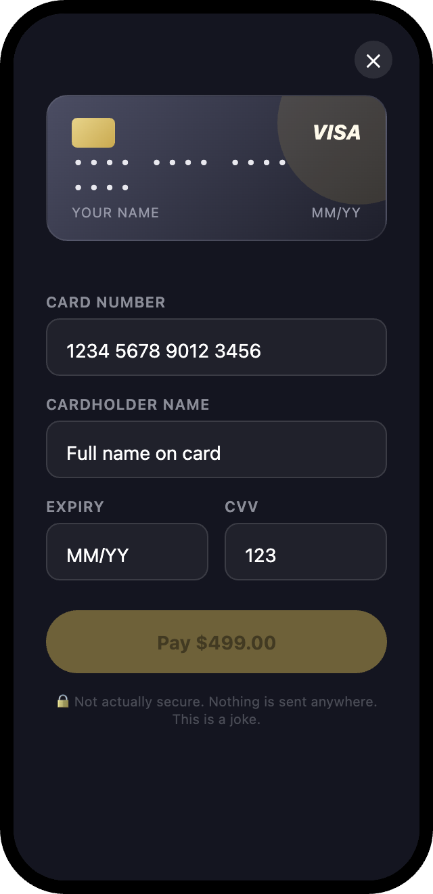

# Flashlight Pro™

> Turning it on was free. Turning it off is a premium experience.

A satirical parody of dark pattern subscription apps, built as a joke. It's a flashlight app where the **On** button works instantly and for free but the **Off** button is locked behind a fake **$499 paywall**.

Inspired by real flashlight apps that lock basic features behind paywalls. This is pure comedy, not a real product.

## 🔗 Live Demo

https://ishrakahmad.github.io/Flashlight-Pro/


## Screenshots

Screenshots

<p align="center">
  
  
  
</p>

## Features

- 🔦 Flashlight On/Off toggle with a glowing screen effect
- 🔒 Fake "Flashlight Pro" paywall — $499 one-time payment to unlock Off
- 📈 Price increases every time you decline ("No thanks, I enjoy the light")
- 💳 Fake Visa card payment form with live card preview
- ⏳ Fake "Processing payment..." sequence with a twist ending
- 📸 Screenshot & Share buttons to save/share the joke
- 📱 Designed to look like a real iPhone flashlight app

## ⚠️ Disclaimer

This is a joke app for entertainment only.

- No real payment is ever processed.
- No card details are stored, sent, or transmitted anywhere — everything happens locally in your browser.
- There is no backend, no server, no database.

## Tech Stack

- HTML, CSS, JavaScript (vanilla, no frameworks)
- [html2canvas](https://html2canvas.hertzen.com/) for the screenshot feature

## Running Locally

Just open `index.html` in a browser — no build step, no dependencies to install.

```bash
git clone https://github.com/<your-username>/flashlight-pro.git
cd flashlight-pro
open index.html
```

## License

Made for fun. Feel free to fork and remix.
